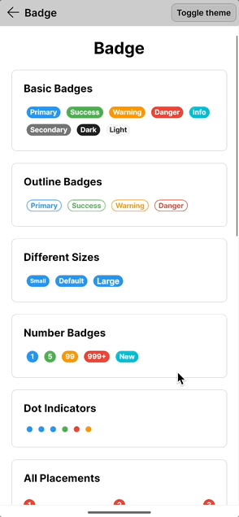

# Welcome to Nova.Avalonia.UI

**Nova.Avalonia.UI** is a comprehensive suite of UI controls for [Avalonia UI](https://avaloniaui.net/), designed to help developers build modern, accessible, and high-performance cross-platform applications.

## Documentation

The docs cover everything from first steps to detailed control APIs and samples, aiming to make the library easy to adopt and extend. If you're interested in exploring more, you can find it here: https://jsuarezruiz.github.io/Nova.Avalonia.UI/

## Controls

### Avatar

The `Avatar` control presents a person's identity using an image, initials, icon, or custom content. It includes automatic background generation, size presets, and optional presence status indicators.

### Badge

The `Badge` control displays a notification badge on top of other content. It supports numeric counts with overflow handling (e.g., "99+"), dot mode, various placements, and customizable styling.

### BarcodeGenerator

The `BarcodeGenerator` control generates and renders various barcode symbologies including QR codes, Data Matrix, Code 128, EAN-13, and more. It supports customizable colors, error correction levels, and logo overlays.

### RatingControl

The `RatingControl` allows users to view and set ratings using interactive items such as stars, hearts, or custom shapes. It supports multiple precision levels, customizable appearance, and full keyboard and pointer interaction.

### Shimmer

The `Shimmer` control shows a lightweight skeleton while your content is loading. It inspects the visual tree beneath it to draw shapes that match controls, then animates a gradient sweep over the placeholders.

## Layout Panels

### ArcPanel

The `ArcPanel` arranges items along an arc (partial circle). Useful for semi-circular menus, dial interfaces, or decorative layouts.

### AutoLayout

A specialized panel reproducing Figma's Auto Layout behavior (Orientation, Spacing, Padding, Alignment).

### BubblePanel

The `BubblePanel` packs circular items using a circle packing algorithm, creating a dense, organic bubble arrangement.

### CircularPanel

The `CircularPanel` arranges items evenly around a circle. Perfect for radial menus, clock faces, or circular arrangements.

### HexPanel

The `HexPanel` arranges items in a honeycomb hexagonal grid. It supports both flat-topped and pointy-topped hexagons.

### LoopPanel

The `LoopPanel` creates an infinite scrolling experience where children wrap seamlessly. It supports drag gestures, mouse wheel, momentum (inertia), and snap-to-item behavior.

### OrbitPanel

The `OrbitPanel` arranges child elements in concentric orbit rings around a center point. Items are distributed evenly radiating from the center.

### OverlapPanel

The `OverlapPanel` stacks children with configurable X/Y offsets, creating card pile or layered effects.

### RadialPanel

The `RadialPanel` positions items in a circular or spiral fan arrangement. It supports configurable radius, start/sweep angles, and item rotation.

### ResponsivePanel

The `ResponsivePanel` is an adaptive panel that toggles visibility of children based on breakpoints (Mobile/Desktop switching).

### StaggeredPanel

The `StaggeredPanel` positions items in a staggered grid, creating a masonry-like effect by filling the shortest column first.

### TimelinePanel

The `TimelinePanel` arranges items in a timeline or step-by-step flow with connecting lines between items.

### VariableSizeWrapPanel

The `VariableSizeWrapPanel` arranges varying-sized items in a wrapping grid, permitting items to span multiple rows and columns similar to the Windows Start Screen.

## Contribute

Do you want to contribute?.

**Found a Bug?**

If you find a bug, you can help me by submitting an [issue](https://github.com/jsuarezruiz/Nova.Avalonia.UI/issues). Even better, you can submit a [Pull Request](https://github.com/jsuarezruiz/Nova.Avalonia.UI/pulls) with a fix.

**Submitting a pull request**

For every contribution, you must:
- Test your code.
- target main branch (or an appropriate release branch if appropriate for a bug fix).

## Feedback or Requests

Use GitHub [Issues](https://github.com/jsuarezruiz/Nova.Avalonia.UI/issues) for bug reports and feature requests.

## Copyright and license

Code released under the [MIT license](https://opensource.org/licenses/MIT).